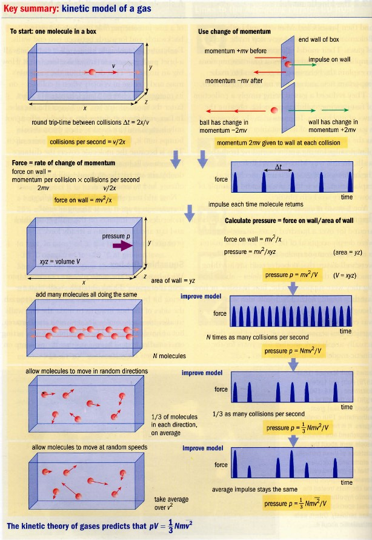

# Ideálny plyn
**Podmienky**:
1. Veľkost molekúl zanedbateľne malé voči vzájomným vzdialenostiam
2. Žiadne vzájomné príťažlivé sily medzi molekulami
3. Zrážky molekúl sú dokonale pružné - zachovanie [kinetickej energie](kinetická%20energia)
4. Čas trvania zrážky je voči dobe voľného pohybu krátky - priamočiarý pohyb

**Dôsledky** týchto podmienok:
1. Potenciálna energia sústavy je nulová
2. [Vnútorná energia](vnútorná%20energia.md) = $\sum$ kin. energií (posuvná, rotačná, kmitavá) častíc

Kedy môže byť reálny plyn považovaný za ideálny?:
1. Dostatočne vysoké teploty
2. Dostatočne nízke tlaky
3. Normálne podmienky ($0^oC; 1.01325*10^5$)

Tri stavové veličiny
- objem $V$
- tlak $p$
- teplota $T$

## Výpočet kinetickej energie
$E_k = \frac{1}{2}m_0v^2_1 + \frac{1}{2}m_0v^2_2 + ... + \frac{1}{2}m_0v^2_n$
$E_k = \frac{1}{2}m_0 * (v^2_1 + v^2_2 + ... + v^2_n)$
$E_k = \frac{1}{2}nm_0 * \frac{v^2_1 + v^2_2 + ... + v^2_n}{n}$
$E_k = \frac{1}{2}nm_0v_0$
Hodnota $v_0$ je pomyselná priemerná rýchlosť častíc plynu.
Je to *stredná kvadratická rýchlosť* a ak by sa vš. častcie hýbali $v_0$ kin. energia by sa nezmenila

### Kinetický model
$p=\frac{N}{3V}m_0v_k^2$

### Zákon ideálneho plynu
Kombinácia Charlesovho, Boylovho, tlakoveho a množstvového zákonu plynov.
$pV = nRT$

p = tlak $N/m^2=Pa$
V = objem $m^3$
n = látkové množstvo $mol$
R = molar gas constant $J*K^{-1}*mol^{-1}$
T = absolútna teplota $K$

Taktiež
$pV^{\kappa}=konšt$
$\kappa=\frac{C_p}{C_V}=\frac{c_p}{c_V}$
$C=c*M$
$C_p=(\frac{\Delta Q}{\Delta T})_p$ - pri konšt p
$C_V=(\frac{\Delta Q}{\Delta T})_V$ - pri konšt V
$C_p-C_V=R$

$\kappa = \frac{i+2}{i}$
$i=\text{stupne voľnosti pre n atómovú molekulu}$
n=1 -> i = 3
n=2 -> i = 5
Najznámejšie $\kappa = 7/5 = 1.4$

### 

**Kombinácia modelov**
$pV=1/3Nmv^2=nRT$
$Nmv^2 = 3nRT$
$...$
Pre veľa molekúl:
$E_k = \frac{3}{2}nRT$
Pre jednu:
$E_k = \frac{3}{2}kT$
k = boltzmanova konštanta

# Atmosféra
$N_2$ - 78,084%
$O_2$ - 20,946%
$Ar$ - 0,934%
$CO_2$ - 0,033%

$M=\sum_i \frac{n_i}{n}M_i$
