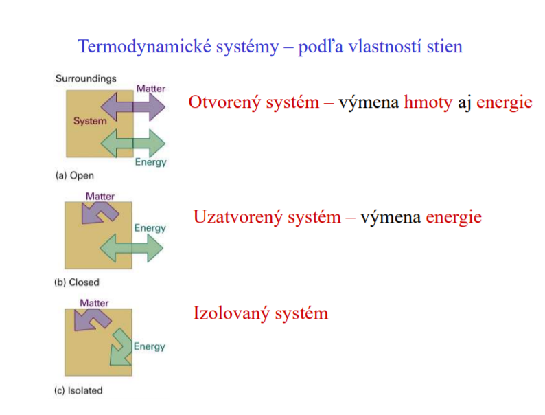
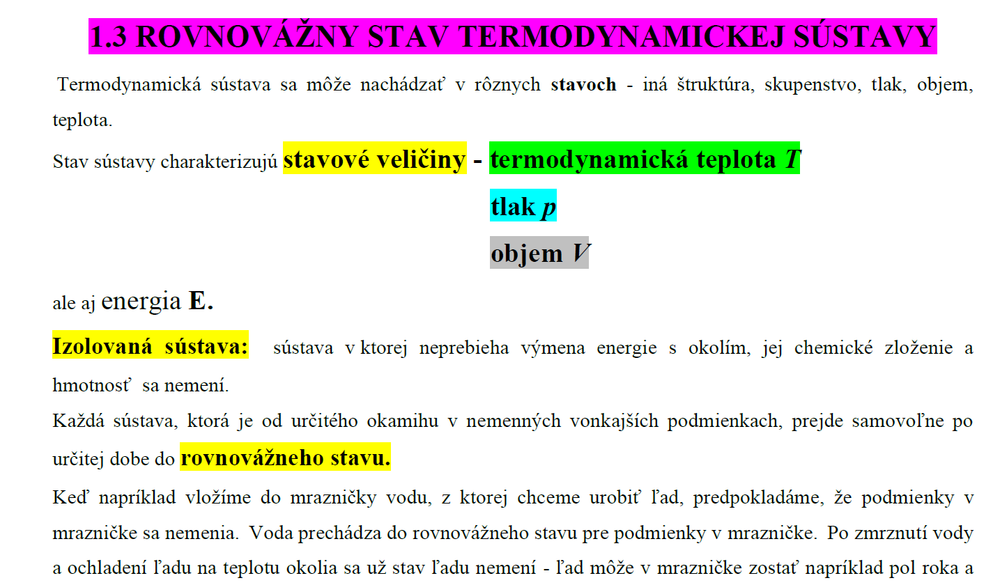

teleso môže byť v rozličných stavoch. Teleso alebo skupina telies, ktorých stav skúmame, sa nazýva termodynamická sústava alebo stručne sústava.  

Veličiny, ktorými je určený stav sústavy, napr. tlak, teplota, objem, energia, sú [stavové veličiny](stavové%20veličiny.md). 

Izolovanou sústavou budeme nazývať sústavu, v ktorej neprebieha výmena energie s okolím a ktorej chemické zloženie a hmotnosť zostávajú konštantné. V izolovanej sústave môžu prebiehať procesy iba medzi telesami, ktoré túto sústavu tvoria. 

Zo skúseností vieme, že Každá sústava, ktorá je od istého okamihu v nemenných vonkajších podmienkach, prejde po istom čase samovoľne do rovnovážneho stavu. V tomto stave zotrvá, kým sa podmienky nezmenia. V rovnovážnom stave zostávajú [stavové veličiny](stavové%20veličiny.md) konštantné. To znamená, že sústava nemení svoj objem, tlak, teplotu, neprebiehajú zmeny skupenstva ani chemické reakcie, sústava je aj v mechanickej rovnováhe. Keď istý dej prebieha tak, že sústava pri tomto deji prechádza niekoľkými na seba nadväzujúcimi rovnovážnymi stavmi, potom sa tento dej volá rovnovážny dej. Za rovnovážne deje možno približne považovať deje, ktoré prebiehajú veľmi pomaly.

