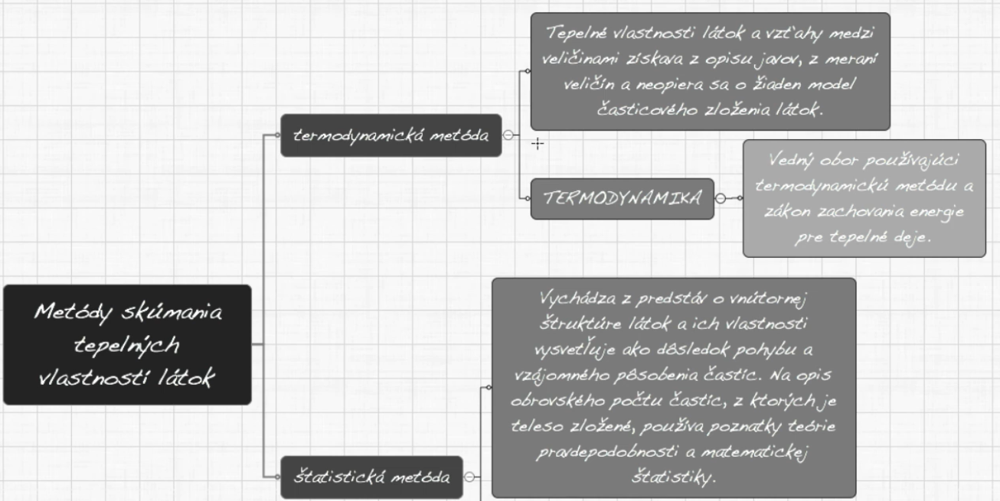

Fyzika skúma tepelné vlastnosti dvoma navzájom odlišnými metódami, ktoré sa navzájom dopĺňajú.

Kinetická teória stavby látok vychádza z troch experimentálne overených poznatkov: 

1.  Látka akéhokoľvek skupenstva sa skladá z častíc - molekúl, atómov a iónov ( 
	- látka má nespojitú (diskrétnu ) štruktúru, medzi časticami je voľný priestor 
	- Experimentálne dôkazy - zobrazovanie elektrónovým mikroskopom a inými zobrazovacími technikami

2.  Častice sa v látke pohybujú ustavične (neustále) a chaoticky ( neusporiadane)  
    - tento pohyb nazývame tepelný pohyb
	-   Experimentálne dôkazy neustáleho, neusporiadaného pohybu látky 
    	-   Tlak plynu 
    	-   Difúzia - samovoľné prenikanie častíc jednej látky medzi častice druhej látky rovnakého skupenstva, ak sú telesá y týchto látok uvedené do vzájomného styku 
    	-   Brownov pohyb 
    	-   Osmóza 
        
3.  Častice na seba navzájom pôsobia príťažlivými a zároveň odpudivými silami 
	- Veľkosť týchto síl závisí od ich vzájomnej vzdialenosti častíc 
	- Experimentálne dôkazy:  
    	- súdržnosť pevných a kvapalných látok 
    	- Sily potrebné pri zmene objemu telies
	- Väzbová energia sa rovná práci, ktorú by bolo potrebné vykonať pôsobením vonkajších síl, aby došlo k zrušeniu väzby medzi časticami.

.png)