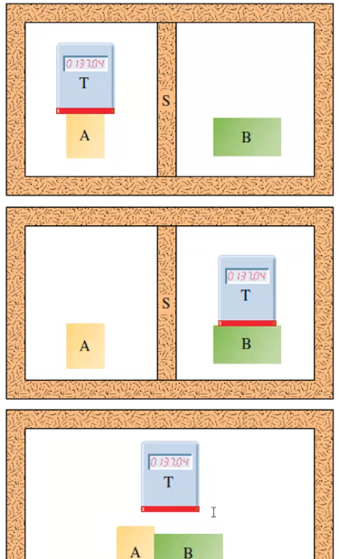
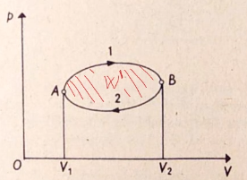
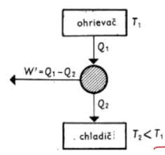

# Termodynamika
**Kalorimetrická rovnica**
$\triangle{}t_1c_1m_1 = \triangle{}t_2c_2m_2$
!()[369f.png]

#### 0-tý zákon
Ak sú systémy A a B v rovnováhe so systémom T (teplomerom), tak budú v rovnováhe navzájom a priradzujeme im rovnakú teplotu.

#### 1. Zákon
`Q = 0` - **adiabatický jav**
Zmena vnútornej energie môže nastať:
 - konaním práce
 - prenosom tepla

**Kruhový dej:** 
- konečný a začiatočný stav je totožný
- graf vyjadrujúci tlak p funkciou objemu V tvorí uzavretú krivku

- plocha uzavretej krivky je W' = práca plynu = $p*\triangle V$

#### 2. Zákon
Nie je možné zostrojiť periodicky pracujúci tepelný stroj, ktorý by teplo od istého telesa (ohrievača) iba prijímal a vykonával rovnako veľkú prácu.

