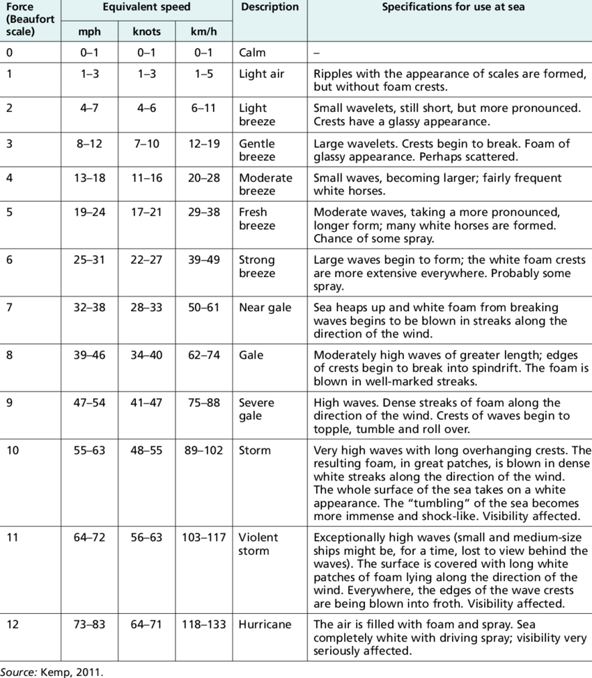

# Atmosféra

vrstvy:
 - troposféra
 - tropopauza
 - stratosféra
 - stratopauza
 - mezosféra
 - mezopauza
 - termosféra
 - termopauza
 - termopauza
 - exosféra

## Vietor

!()[0386.png]

## Klimatotvorné činitele

 - rozmiestnenie oceánov
   - tepelná kapacita
   - vo vode stálejšie podnebie
   - súš sa rýchlejšie zohrieva a rýchlejšie chladne
   - najnižšia teplota na súši - -89.6
   - najvyššia teplota na súši - 56.7
   - najvyššia priemerná teplota na súši - 31
   - najnižšia priemerná teplota na súši - -16.7
 - nadmorská výška, charakter povrchu
   - teplota klesá s výškou - 0.6 stupňa na 100m
   - FARBA je tiež dôležitá
   - orientácia svahu
 - geografická šírka
 - cirkulácia atmosféry
 - činnosť človeka
 - morské prúdy

## Klimatické prvky
 - teplota
   - od rovníka k pólom sa znižuje
   - nadmorská myška
   - charakter povrchu
 - vlhkosť
   - 100% - vzduch už nevezme viac vody
   - nas 100% sú zrážky
 - tlak
   - normálne 1013 hPa
   - tlaková výš - anticyklóna - čisté suché počasie - extrémne teploty
   - tlaková níž - cyklóna - škaredé počasie - akurat teploty

   - dôležité tlakové myše:
     - azorská výš
     - sibírska výš
     - islandsá níž
     - iránska níž
 - vietor
   - smer
   - rýchlosť
   - Beaufortova Stupnica

- monzún
      - v lete fúka vietor od oceánu k pevnine a prší
      - v zime prináša monzún zrážky na pobrežie
   - bríza - malý monzún v priebehu dňa
      - v noci fúka z pevniny na more
      - cez deň ide vietor od mora k pevnine
   - föhn - na náveternej strane prichádza mokrý vzduch
      - cestou hore sa ochladzuje
         - na náveternej strane prší
      - ako vzduch klesá, otepľuje
      - na opačnej strane je potom teplý suchý vzduch
      - rozpúšťa sneh
   - dolinový a horský vietor - z pohoria a do pohoria
   - bariérny efekt - pohoria zastavujú vietor
   - Bóra - studený padavý vzduch keď sa vzduch nestihne zohriať dolu kopcom
 - oblačnosť
   - kopa - cumulus
   - riasa - cirrus
   - sloha - stratus
 - zrážky
   - kvapky:
     - mrholenie - do 0.5mm
     - daždové zrážky - do 2mm
     - zmrznutý dážď - 2mm - 5mm
     - krúpy - nad 5mm
   - štyri pásma zeme:
     - vlhké teplé pásmo - 1000-5000mm za rok
       - na rovníku prší každý deň (večer)
     - suché teplé pásmo - do 250mm za rok
     - vlhké mierne pásmo - do 1000mm za rok
       - 35 - 65 stupňou
     - suché studené pásmo
       - sneH

### Oceanita a kontinentalita
od pobrežia do vnútrozemia sa znižuje množstvo zrážok a zvyšuje sa amplitúda teplot - vačšie zmeny

### Podnebné pásma
1. Ekvatoriálne - Stále počasie, teplo, vysoká vlhkosť - zrážky (1000-3000mm/r)
2. Sub-ekvatoriálne - Vačšie rozdiely v teplote, teplo
3. Tropické - Veľké rozdiely v teplote (deň a noc), najvačšie teplo a veľké sucho
4. Sub-tropické - Leto - tropické; Zima - mierna;
5. Mierne
6. Sub-arktické
7. Arktické

