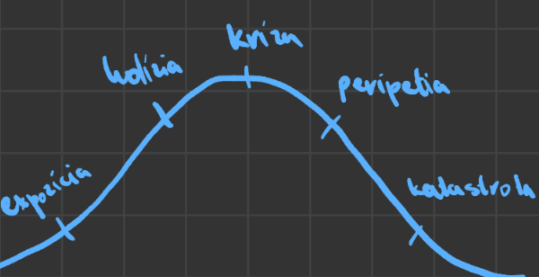

# Dráma
==literárny druh== (ly, ep, dr) - najkomlexnejší

Blízky k *epike*:
Má dej a časovú postupnosť, ale epika sa už odohrala, pričom dráma je v reálnom čase (herci)
Spoločnú z *lyrikou* má reflexiu -> "Byť či nebyť?"

Použitie aj verbálnych aj neverbálnych prostriedkov
Hovorový a umelecký štýl využíva hlavne dialógy
Neverbálne:
	- **paraliguistické** - tanec a pohyby
	- **extraliguistické** - svetlo, hudba, rekvity

Vznikla v antickom Grécku kvôli politike a oslavám Dionýza (boh vína) kvôli dobrej úrode.
Odohrávala sa v amfiteatroch, protagonista, dialóg, väčší počet účinkujúcich.
**Chór** (12-16 členov, neskôr 24) - náčelník koryfej, ostatní choreuti.
Bol ekvivalentný **rozprávačovi** - komentovanie deja a vlastnosti postáv; spev a tanec	; *hodnotiaca funkcia*
Hrať mohli iba muži a použivali masky na paličkách.

stredovek - pouličné kočovné divadlá; herci = igrici -> najímaný pánom
18.st. - pódium a kamenné divadlá
20.sts. - veľký vývin - *4 zložky* dramatického umenia - `rozhlas, film, divadlo, televízia`

## Kompozícia
### Vonkajšia komp.
To, čo divák vidí: herci, pódium, rekvizity, dialógy

tvorí ju:
 - dejstvá, výstupy a scéna
 - dialóg, monológ a replika

**dejstvo** = časť drámy oddelená prestávkami; väčšinou sú 3 (do 20. st 5); 1 = jednoaktovka
**výstup** = zmena počtu postáv
**scéna** = zmena prostredia / rekvizít
**replika** = prehovor jednej postavy

### Vnútorná komp.

**expozícia** = predstavenie postáv, úvod
**kolízia** = zápletka
**kríza** = vyvrcholenie
**peripetia** = rozuzlenie
**katastrofa** = záver (nie vždy zlý/katastrofálny)

